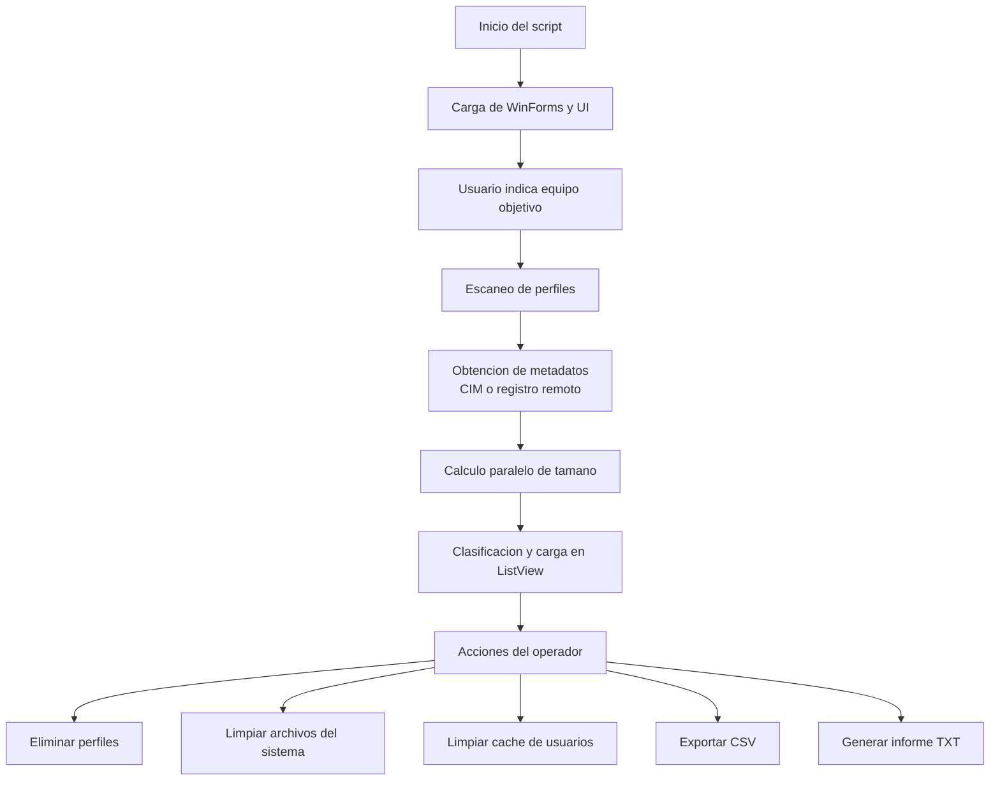

# GhostHunter

GhostHunter es una utilidad de escritorio escrita en PowerShell con interfaz WinForms para analizar, clasificar y limpiar perfiles de usuario de Windows en equipos locales o remotos.

Su objetivo principal es ayudar a identificar perfiles inactivos o pequenos, eliminar perfiles huerfanos de forma controlada y ejecutar tareas complementarias de limpieza de sistema y cache de usuarios.

## Tabla de contenidos

- [Resumen](#resumen)
- [Caracteristicas principales](#caracteristicas-principales)
- [Casos de uso](#casos-de-uso)
- [Arquitectura general](#arquitectura-general)
- [Estructura del repositorio](#estructura-del-repositorio)
- [Requisitos](#requisitos)
- [Permisos y prerrequisitos del entorno](#permisos-y-prerrequisitos-del-entorno)
- [Instalacion y ejecucion](#instalacion-y-ejecucion)
- [Guia de uso](#guia-de-uso)
- [Como funciona el analisis de perfiles](#como-funciona-el-analisis-de-perfiles)
- [Como funciona la eliminacion de perfiles](#como-funciona-la-eliminacion-de-perfiles)
- [Limpieza de sistema y cache](#limpieza-de-sistema-y-cache)
- [Exportaciones e informes](#exportaciones-e-informes)
- [Funciones principales del script](#funciones-principales-del-script)
- [Datos de salida y estado interno](#datos-de-salida-y-estado-interno)
- [Limitaciones y consideraciones actuales](#limitaciones-y-consideraciones-actuales)
- [Troubleshooting](#troubleshooting)
- [Seguridad y buenas practicas](#seguridad-y-buenas-practicas)
- [Mejoras recomendadas](#mejoras-recomendadas)
- [Licencia](#licencia)
- [Estado del proyecto](#estado-del-proyecto)

## Resumen

GhostHunter esta pensado para escenarios de soporte tecnico, administracion de puestos y mantenimiento de equipos Windows donde se necesita:

- Detectar perfiles locales de `C:\Users`.
- Identificar perfiles antiguos, pequenos o probablemente eliminables.
- Proteger perfiles cargados en memoria o usados recientemente.
- Borrar perfiles de forma agresiva cuando la eliminacion normal falla.
- Limpiar archivos temporales del sistema.
- Limpiar cache de usuario en perfiles locales.
- Exportar resultados a CSV y generar informes TXT.

La aplicacion esta implementada como un unico script PowerShell con interfaz grafica WinForms:

- Archivo principal: `GhostHunter.ps1`
- Interfaz: Windows Forms
- Persistencia: no usa base de datos; trabaja en memoria y exporta archivos al escritorio
- Alcance: local y remoto, siempre que el entorno permita acceso administrativo

## Caracteristicas principales

- Escaneo de perfiles locales en el equipo objetivo.
- Compatibilidad con equipo local o remoto mediante parametro `-Equipo`.
- Deteccion por `Win32_UserProfile` via CIM, con fallback a registro remoto.
- Exclusiones amplias para cuentas del sistema, servicios y perfiles tecnicos.
- Calculo paralelo del tamano de cada perfil mediante jobs.
- Clasificacion visual por color:
  - Azul: perfil protegido/en uso.
  - Verde: perfil activo.
  - Rojo: perfil eliminable.
- Filtros por antiguedad y tamano.
- Marcado automatico de perfiles eliminables.
- Eliminacion por lotes con resumen final detallado.
- Multiples estrategias de borrado forzado.
- Limpieza de temporales del sistema.
- Limpieza de cache por usuario.
- Exportacion de resultados a CSV.
- Generacion de informe TXT.
- Limpieza de jobs huerfanos al iniciar y al cerrar la aplicacion.

## Casos de uso

- Recuperar espacio en disco en puestos compartidos.
- Eliminar perfiles de usuarios que ya no usan un equipo.
- Revisar perfiles potencialmente huerfanos en equipos de dominio.
- Limpiar cache local antes de una entrega o reprovisionamiento.
- Obtener una fotografia del estado de perfiles para auditoria interna.

## Arquitectura general

La aplicacion sigue una estructura monolitica, pero internamente esta separada por bloques funcionales.



A nivel logico, el script se divide en:

1. Analisis de perfiles.
2. Carga de datos en la interfaz.
3. Funciones auxiliares y de verificacion.
4. Limpieza de archivos temporales.
5. Eliminacion de perfiles.
6. Exportacion e informes.
7. UI y gestion del ciclo de vida.

## Estructura del repositorio

El repositorio actual es muy pequeno y contiene toda la aplicacion en un solo archivo.

```text
GhostHunter/
|-- GhostHunter.ps1
|-- README.md
```

### Archivo principal

- `GhostHunter.ps1`: contiene parametros, logica de negocio, interfaz grafica, jobs paralelos y exportaciones.

## Requisitos

### Sistema operativo

- Windows

### Entorno recomendado

- Windows PowerShell 5.1 o entorno PowerShell compatible con WinForms en Windows

### Componentes usados por el script

- `System.Windows.Forms`
- `System.Drawing`
- WMI/CIM (`Win32_UserProfile`)
- Registro remoto de Windows
- Comparticion administrativa `C$`
- Utilidades del sistema:
  - `robocopy`
  - `cmd.exe`
  - `takeown`
  - `icacls`

### Dependencias externas

No requiere paquetes de terceros ni modulos adicionales del repositorio.

## Permisos y prerrequisitos del entorno

Para que GhostHunter funcione correctamente, especialmente contra equipos remotos, conviene cumplir estas condiciones:

- Ejecutar el script con permisos de administrador.
- Tener permisos administrativos sobre el equipo objetivo.
- Tener acceso a `\\EQUIPO\C$`.
- Tener acceso a CIM/WMI remoto o, en su defecto, al registro remoto.
- Permitir acceso de red y firewall a los servicios necesarios.
- Verificar que el usuario cuyo perfil se va a borrar no tenga sesion activa.

### Importante

GhostHunter realiza operaciones destructivas:

- elimina archivos;
- elimina claves de registro de perfiles;
- puede programar borrados tras reinicio;
- puede tomar posesion y modificar ACLs sobre carpetas locales.

No debe ejecutarse a ciegas sobre equipos de produccion sin validacion previa.

## Instalacion y ejecucion

### 1. Clonar o copiar el repositorio

```powershell
git clone <url-del-repositorio>
cd GhostHunter
```

### 2. Ejecutar el script

#### Ejecucion local

```powershell
powershell -ExecutionPolicy Bypass -File .\GhostHunter.ps1
```

#### Ejecucion indicando equipo objetivo

```powershell
powershell -ExecutionPolicy Bypass -File .\GhostHunter.ps1 -Equipo PC-DESTINO
```

Si no se pasa `-Equipo`, el script usa por defecto el nombre del equipo actual.

### 3. Permitir ejecucion de scripts si fuera necesario

Si el entorno bloquea la ejecucion de scripts, revisar la politica de ejecucion de PowerShell:

```powershell
Get-ExecutionPolicy
```

Y ajustar segun la politica de seguridad de tu organizacion.

## Guia de uso

### Flujo operativo recomendado

1. Abrir GhostHunter como administrador.
2. Escribir el nombre del equipo en `Equipo objetivo`.
3. Pulsar `Escanear`.
4. Revisar la lista de perfiles detectados.
5. Aplicar filtros si hace falta.
6. Validar los perfiles marcados automaticamente.
7. Ejecutar una de las acciones disponibles:
   - `Eliminar Perfiles Marcados`
   - `Limpiar Archivos Sistema`
   - `Limpiar Cache Usuarios`
   - `Exportar resultados`
   - `Generar informe`

### Elementos principales de la interfaz

#### Campo de equipo

Permite indicar el equipo que se desea analizar. Si queda vacio, se usa el equipo local.

#### Boton `Escanear`

Lanza el analisis completo de perfiles y rellena la tabla principal.

#### ListView principal

Muestra por perfil:

- Usuario
- Ultimo logon / ultimo uso conocido
- Tamano
- Estado
- SID

#### Filtros

- `Mostrar Perfiles Antiguos`
- `Mostrar Perfiles < 1 GB`

Estos filtros no recalculan datos; solo ajustan lo que se muestra en pantalla.

#### Boton `Eliminar Perfiles Marcados`

Procesa los perfiles checkeados cuyo estado sea `Eliminable`.

#### Boton `Limpiar Archivos Sistema`

Ejecuta limpieza sobre rutas de temporales del sistema.

#### Boton `Limpiar Cache Usuarios`

Elimina cache y temporales en perfiles de usuario.

#### Boton `Exportar resultados`

Genera un CSV en el escritorio con los elementos visibles en la lista.

#### Boton `Generar informe`

Genera un TXT en el escritorio con un resumen completo del analisis cargado.

## Como funciona el analisis de perfiles

### 1. Descubrimiento de perfiles

La funcion principal de escaneo es `Get-PerfilesLocales`.

Su estrategia es:

1. Intentar obtener perfiles por `Win32_UserProfile` mediante `Get-CimInstance`.
2. Filtrar perfiles especiales y rutas fuera de `C:\Users`.
3. Si CIM falla, usar el registro remoto en:

```text
HKLM\SOFTWARE\Microsoft\Windows NT\CurrentVersion\ProfileList
```

### 2. Exclusiones

El script excluye muchos nombres de perfil para evitar cuentas tecnicas o del sistema:

- `Default`
- `Public`
- `Administrator` / `Administrador`
- `LocalService`
- `NetworkService`
- cuentas IIS
- cuentas SQL
- cuentas Exchange
- `WDAGUtilityAccount`
- patrones como `svc_*`, `S-1-5-*`, `HealthMailbox*`, etc.

Esto reduce falsos positivos durante el analisis.

### 3. Fecha de ultimo uso

GhostHunter no depende exclusivamente de eventos de seguridad.

El flujo actual usa:

- `LastUseTime` de `Win32_UserProfile` cuando esta disponible;
- si no existe, intenta estimarlo desde el registro y la carpeta del perfil;
- si tampoco puede obtenerlo, asigna una fecha artificial de hace 365 dias.

### 4. Calculo de tamano

El tamano del perfil se calcula en jobs paralelos:

- se agrupan perfiles por bloques;
- se recorre la carpeta del perfil via UNC;
- se intenta primero con `System.IO.Directory.EnumerateFiles`;
- si falla, se usa `Get-ChildItem -Recurse` como fallback.

### 5. Reglas de clasificacion

Cada perfil termina clasificado en uno de estos estados:

- `Protegido (perfil en uso)`
  - cuando `Win32_UserProfile.Loaded` indica que el perfil esta cargado.
- `Activo (usado recientemente)`
  - cuando no cumple criterios de eliminacion.
- `Eliminable (...)`
  - cuando el perfil supera determinados umbrales de inactividad o tamano.

### Criterios de eliminacion usados por el script

- Perfil pequeno: menos de `1 GB`
- Perfil antiguo: mas de `91 dias` sin uso
- Perfil pequeno con inactividad minima: mas de `30 dias` sin uso

En resumen, un perfil puede marcarse como eliminable por:

- ser antiguo;
- ser pequeno y suficientemente inactivo;
- ser pequeno y antiguo.

## Como funciona la eliminacion de perfiles

La eliminacion es la parte mas agresiva de la herramienta.

### Flujo general

1. El operador selecciona perfiles checkeados.
2. GhostHunter valida que su estado sea `Eliminable`.
3. Los perfiles se procesan por lotes en jobs paralelos.
4. Para cada perfil:
   - intenta eliminar la clave de registro del perfil;
   - renombra la carpeta del perfil a `_old`;
   - intenta eliminar la carpeta con varios metodos;
   - verifica el estado final;
   - muestra un resumen prominente.

### Estrategias de borrado forzado

Cuando la eliminacion normal falla, el script prueba, en este orden aproximado:

1. `Remove-Item -Recurse -Force`
2. limpieza previa de subcarpetas conflictivas para perfiles grandes
3. `robocopy` con una carpeta vacia y `/MIR`
4. `cmd.exe /c rd /s /q`
5. `takeown` + `icacls` para tomar posesion y dar permisos
6. nuevo intento con PowerShell elevado
7. registro en `PendingFileRenameOperations` para borrar tras reinicio
8. creacion de un script manual de ultimo recurso

### Verificacion de estado

Tras el borrado, GhostHunter intenta determinar si el perfil ha quedado:

- completamente eliminado;
- renombrado a `_old` y pendiente de eliminar;
- con el registro eliminado pero la carpeta intacta;
- con la carpeta eliminada pero el registro pendiente;
- sin eliminar;
- con error de verificacion.

### Resumen final

La aplicacion muestra una ventana de resumen con:

- perfiles eliminados;
- perfiles con error;
- estadisticas de jobs;
- recomendaciones;
- soluciones orientativas segun el tipo de fallo.

## Limpieza de sistema y cache

GhostHunter ofrece dos acciones de limpieza adicionales.

### Limpiar Archivos Sistema

La funcion `Limpiar-ArchivosTemporales` revisa:

- `C:\Windows\Installer`
- `C:\Windows\Temp`
- `C:\Windows\Logs\CBS`

Regla general:

- elimina archivos que encajan con los patrones definidos;
- intenta trabajar sobre archivos con antiguedad superior a 7 dias.

### Limpiar Cache Usuarios

La funcion `Limpiar-CacheUsuarios` revisa, por cada usuario:

- `AppData\Local\Temp`
- `AppData\Local\Microsoft\Windows\INetCache`
- `AppData\Local\Google\Chrome\User Data\Default\Cache`
- `AppData\Local\Microsoft\Edge\User Data\Default\Cache`

Regla general:

- intenta borrar archivos con antiguedad superior a 3 dias.

## Exportaciones e informes

### Exportacion CSV

El boton `Exportar resultados` genera un archivo como:

```text
Desktop\Perfiles_<EQUIPO>_yyyyMMdd_HHmm.csv
```

Campos exportados:

- Usuario
- UltimoLogon
- Tamano
- Estado
- SID
- Equipo
- Exportado

### Informe TXT

El boton `Generar informe` crea un archivo como:

```text
Desktop\Informe_GhostHunter_<EQUIPO>_yyyyMMdd_HHmm.txt
```

El informe incluye:

- fecha y hora;
- equipo analizado;
- total de perfiles;
- conteo de perfiles activos y eliminables;
- detalle por perfil.

## Funciones principales del script

Estas son las funciones mas importantes a nivel de mantenimiento.

### Analisis

- `Get-UltimoLogonExitoso`
  - consulta eventos de seguridad 4624 para estimar ultimo logon.
  - actualmente no es parte del flujo principal de clasificacion.
- `Get-FechaCreacionPerfil`
  - obtiene fecha desde registro o carpeta del perfil.
- `Get-PerfilesLocales`
  - funcion central de descubrimiento, tamano y clasificacion.
- `Cargar-PerfilesEnLista`
  - enlaza el resultado del escaneo con la UI.

### Auxiliares

- `Format-TamanoArchivo`
  - formatea bytes a MB o GB.
- `Get-SolucionesError`
  - genera recomendaciones orientativas segun tipo de error.
- `Verificar-EliminacionPerfil`
  - comprueba registro, carpeta original y carpeta `_old`.
- `Test-Administrator`
  - detecta si el proceso tiene privilegios elevados.

### Eliminacion

- `Forzar-EliminarCarpeta`
  - concentra los intentos de borrado forzado.
- `Eliminar-PerfilCompleto`
  - coordina borrado de registro y carpeta.
- `Eliminar-PerfilesMarcados`
  - procesa la seleccion del operador y compone el resumen final.

### Limpieza

- `Limpiar-ArchivosTemporales`
  - limpia archivos del sistema.
- `Limpiar-CacheUsuarios`
  - limpia cache de los perfiles de usuario.

### Exportacion y UI

- `Exportar-PerfilesCSV`
  - exporta el estado visible del ListView.
- `Generar-InformeTXT`
  - crea el informe textual.
- `Mostrar-ResumenProminente`
  - abre la ventana final de resultados.
- `Refrescar-ListViewFiltrado`
  - recalcula que elementos se muestran.

### Gestion del ciclo de vida

- `Limpiar-JobsHuérfanos`
  - elimina jobs pendientes de ejecuciones anteriores.
- `Limpiar-JobsAlCerrar`
  - limpia jobs al cerrar la aplicacion.

## Datos de salida y estado interno

GhostHunter trabaja sin base de datos.

### Estado en memoria

El estado principal del escaneo se mantiene en:

- `$global:PerfilesCargados`

Ese array alimenta:

- los filtros;
- la generacion de informes;
- la recarga del ListView.

### Archivos generados

La aplicacion puede escribir en el escritorio del usuario que ejecuta el script:

- CSV de resultados
- TXT de informe
- script de borrado manual de ultimo recurso, en ciertos fallos de eliminacion

## Limitaciones y consideraciones actuales

GhostHunter es funcional, pero su implementacion actual tiene limitaciones importantes que conviene documentar.

### 1. Script monolitico

Toda la aplicacion vive en un unico `.ps1`. Esto dificulta:

- pruebas automatizadas;
- reutilizacion de codigo;
- aislamiento de responsabilidades;
- mantenimiento evolutivo.

### 2. Acoplamiento fuerte entre UI y logica

La logica de negocio y la interfaz estan mezcladas en el mismo archivo y comparten estado global.

### 3. Dependencia fuerte del entorno Windows

No es una herramienta portable.

Depende de:

- WinForms;
- permisos elevados;
- registro remoto;
- comparticiones administrativas;
- utilidades propias de Windows.

### 4. Ausencia de test suite

El repositorio no incluye:

- tests unitarios;
- tests de integracion;
- pipeline de validacion automatica.

### 5. Observaciones tecnicas detectadas en el analisis estatico

Durante la revision del codigo se han identificado varios puntos a vigilar:

- hay contadores del resumen de eliminacion que actualmente no se calculan antes de mostrarse;
- la logica de timeout adaptativo usa una variable de perfil antes de asignarla;
- algunos mensajes de limpieza esperan propiedades en MB que no siempre se devuelven con ese nombre;
- existe una funcion global `Eliminar-PerfilCompleto` que depende de una `Remove-ClaveRegistro` no definida globalmente; el flujo real de UI usa una version interna dentro de los jobs.

Estas observaciones no invalidan el objetivo de la herramienta, pero si deben tenerse en cuenta al mantenerla o ampliarla.

## Troubleshooting

### No aparecen perfiles

Posibles causas:

- el equipo remoto no responde;
- no hay acceso por red;
- CIM falla y el registro remoto tampoco es accesible;
- faltan permisos administrativos;
- la ruta `C:\Users` no es accesible via `C$`.

### Error de acceso denegado

Revisar:

- que PowerShell se esta ejecutando como administrador;
- que la cuenta tiene permisos sobre el equipo remoto;
- que no hay restricciones de UAC remoto;
- que `C$` esta accesible.

### No se puede borrar la carpeta del perfil

Posibles causas:

- el usuario sigue conectado;
- hay procesos reteniendo archivos;
- ACLs corruptas o demasiado restrictivas;
- antivirus o software de terceros bloqueando el borrado.

Acciones recomendadas:

- cerrar sesion del usuario;
- reiniciar el equipo;
- volver a ejecutar como administrador;
- revisar si la carpeta quedo como `_old`;
- comprobar si el borrado fue programado para el siguiente reinicio.

### La aplicacion abre pero no muestra progreso real

En varias operaciones la interfaz usa cuadros de progreso simples o de tipo indeterminado. Eso es esperable en el estado actual del proyecto.

### El CSV o el TXT no aparece

Comprobar:

- que el escritorio del usuario actual existe;
- permisos de escritura;
- que el antivirus no este bloqueando la generacion del archivo.

## Seguridad y buenas practicas

- Ejecutar primero en un entorno de prueba.
- Verificar manualmente los perfiles marcados antes de borrarlos.
- No borrar perfiles protegidos o cargados en memoria.
- Asegurarse de que el usuario no tenga sesion activa.
- Mantener copia de seguridad o punto de restauracion cuando proceda.
- Documentar que equipos y perfiles se han limpiado.
- Revisar el informe TXT o exportar CSV antes y despues de operaciones masivas.

## Mejoras recomendadas

Si el proyecto va a seguir creciendo, estas serian las mejoras mas valiosas:

1. Separar el script en modulos:
   - descubrimiento
   - clasificacion
   - eliminacion
   - limpieza
   - UI
2. Introducir tests unitarios para la logica no destructiva.
3. Crear una capa de configuracion externa para umbrales y exclusiones.
4. Registrar logs estructurados en archivo.
5. Corregir los puntos tecnicos detectados en la eliminacion y resumen.
6. Mejorar el reporting visual y el seguimiento de progreso.
7. Añadir soporte para configuraciones por entorno o cliente.
